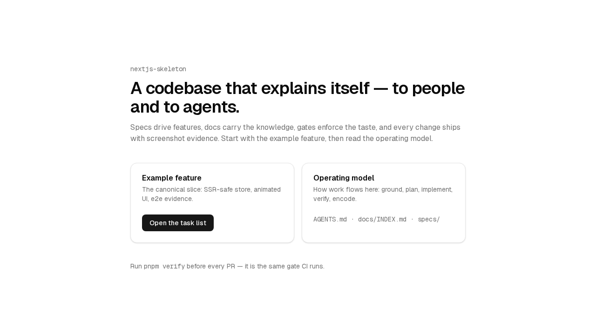
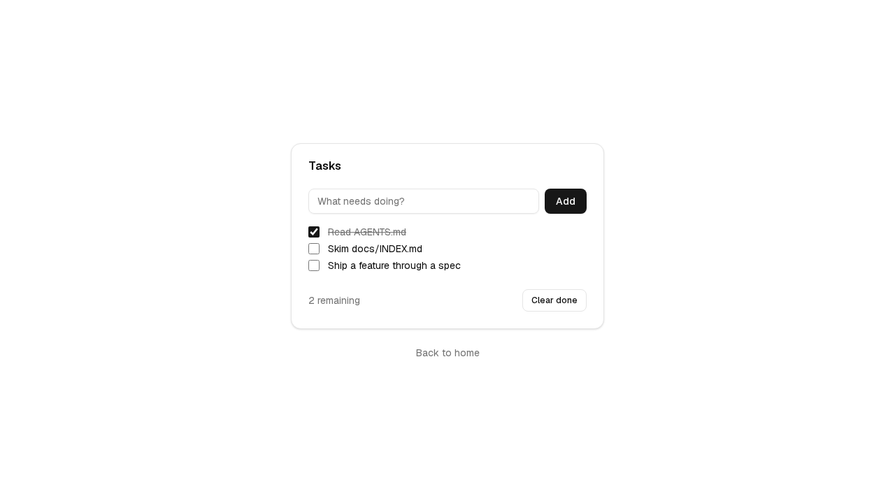
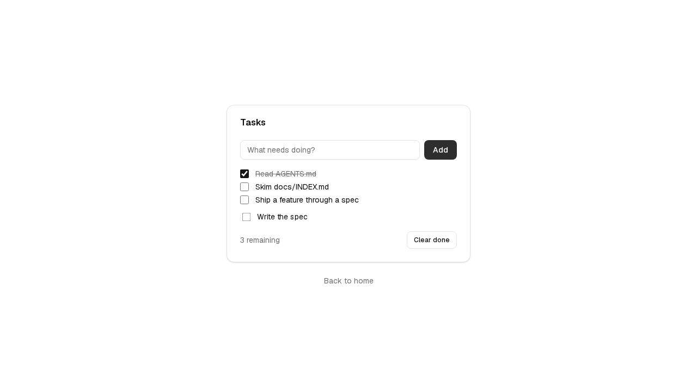
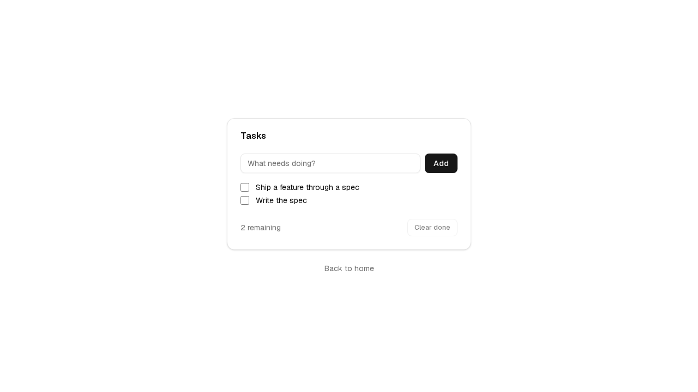

# Feature report — 001 Task list demo

- **Spec:** [specs/001-task-list](../../specs/001-task-list/spec.md) · **Status:** shipped with skeleton baseline
- **Date:** 2026-06-07 · **Author:** Engineering + Claude (agent-implemented, human-reviewed)

## What & why

The skeleton's reference feature: a minimal task manager proving every harness mechanism end-to-end — module boundaries, SSR-safe Zustand state, Motion animation, zod-validated action stub, CUJ e2e tests, and this very report. New features imitate this slice.

## Acceptance criteria → evidence

| AC                                               | Proven by                                               | Evidence                                             | Verdict |
| ------------------------------------------------ | ------------------------------------------------------- | ---------------------------------------------------- | ------- |
| AC-1 add task, input clears                      | `store.test.ts` + `e2e/task-list.spec.ts` step 2        | [tasks-added](001-task-list/img/tasks-added.png)     | PASS    |
| AC-2 toggle updates remaining count              | `store.test.ts` + e2e step 3                            | [tasks-toggled](001-task-list/img/tasks-toggled.png) | PASS    |
| AC-3 blank title is a no-op                      | `store.test.ts` + e2e step 4 (`required` + store guard) | count assertion in spec                              | PASS    |
| AC-4 clear done removes only done, then disables | `store.test.ts` + e2e step 5                            | [tasks-cleared](001-task-list/img/tasks-cleared.png) | PASS    |

## Screenshots

|                                                                                     |                                                                                     |
| ----------------------------------------------------------------------------------- | ----------------------------------------------------------------------------------- |
|  Home — entry to the example (CUJ-01) |  Seeded list, one task already done  |
|  After adding “Write the spec”           |  Done tasks cleared, button disabled |

## Changes by layer

- `features/task-list` — types (zod), vanilla store factory, context provider, animated client island, painted-door action.
- `app` — `/examples/tasks` route (RSC seeds provider) with designed `loading.tsx` and `error.tsx`; home page links the journey.
- `shared` — `components/ui` (button, input, card), `components/motion.tsx` (LazyMotion provider + shared variants), `lib/utils`, `lib/format`.
- `e2e` — CUJ-01 and CUJ-02 specs with `shot()` evidence capture.

Notable decision: store provider uses a lazy `useState` initializer (one store per mount) — the `useRef` pattern trips React's `react-hooks/refs` lint in React 19; encoded in `docs/conventions/state.md` via the canonical slice.

## Verification

- `pnpm verify` green: lint (boundaries clean) · typecheck · format · docs links (58 files) · typography · 9/9 unit tests · production build.
- E2E: 2/2 CUJs pass (chromium); screenshots captured and visually inspected against ACs.
- Persona review: applied during construction (heading semantics finding → CardTitle is a real `h3` now).

## Follow-ups

- Real persistence behind `saveTasksAction` is intentionally left to consuming projects (out of scope by spec).
- First real feature in a clone should run the full `/create-spec → /feature-report` loop to validate team setup.
