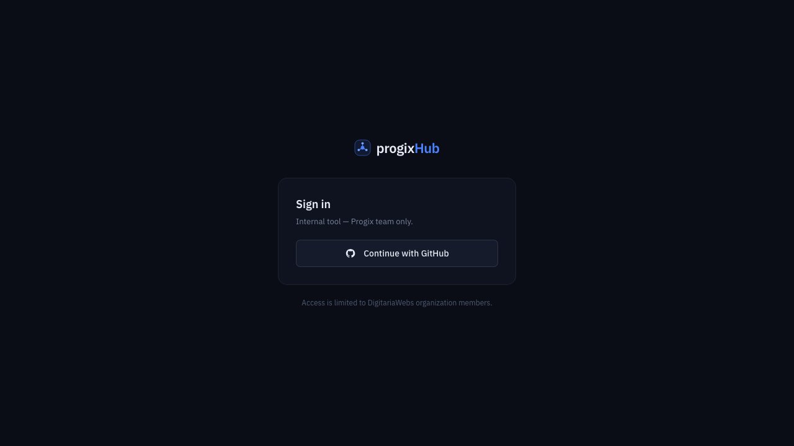
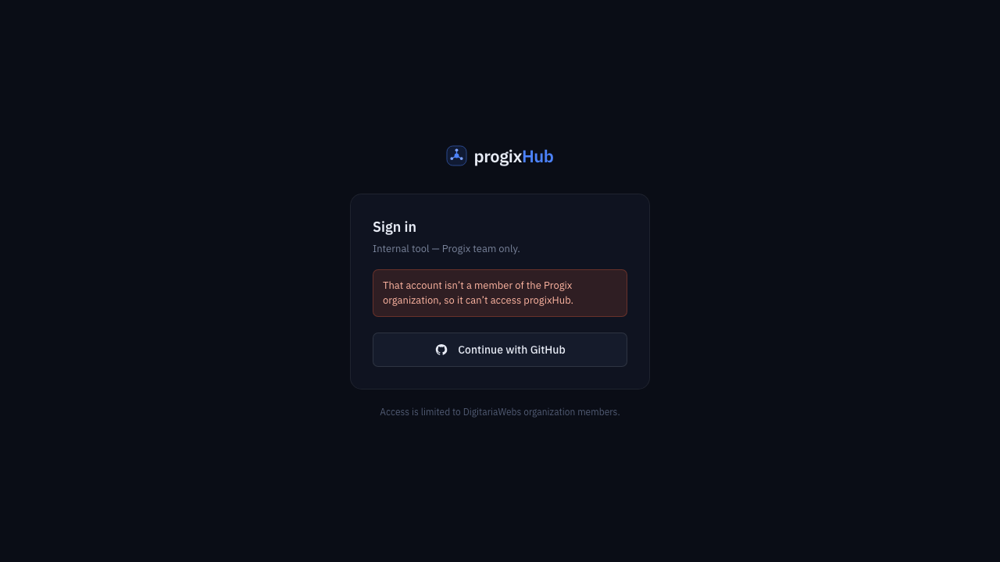
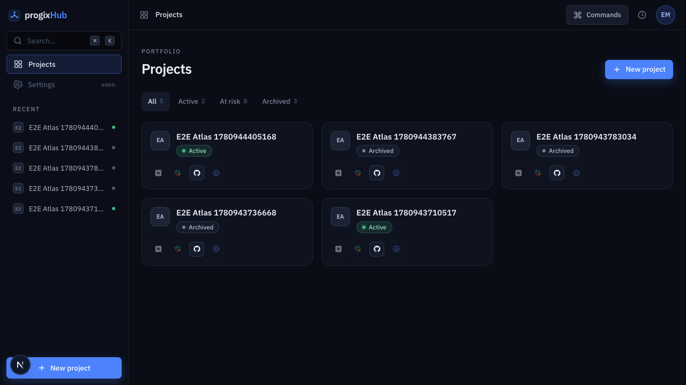
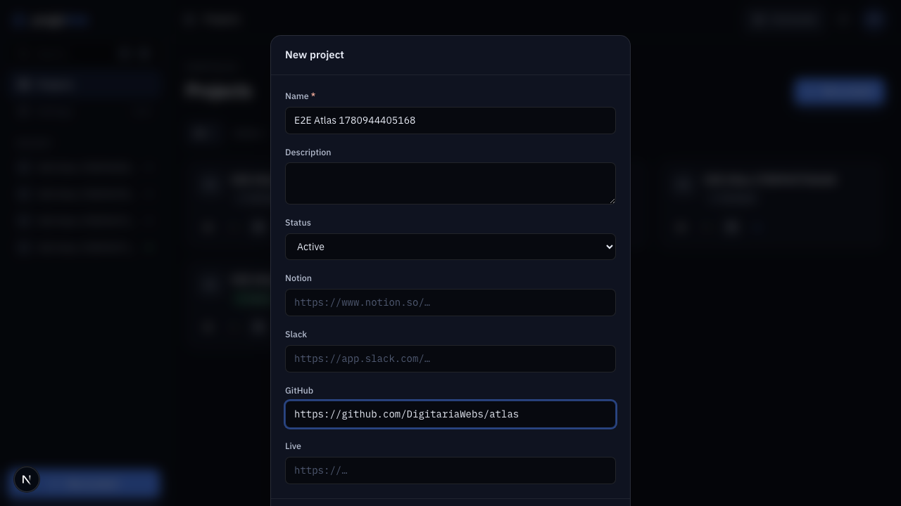
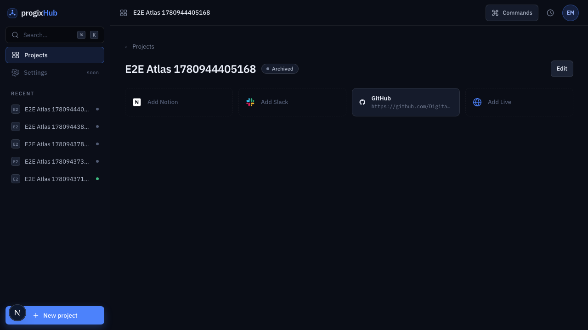

# Feature report — 002 Sign-in & project registry

- **Spec:** [specs/002-auth-and-projects](../../specs/002-auth-and-projects/spec.md) · **Plan:** [plan.md](../../specs/002-auth-and-projects/plan.md)
- **Branch:** `feat/002-auth-and-projects` · **Date:** 2026-06-08 · **Author:** agent-implemented, persona-reviewed
- **Diff:** 53 files, +1821 / −263 · 6 conventional commits

## What & why

progixHub had no sign-in and a painted-door portfolio of fake projects. This feature makes it real: a visitor must sign in with GitHub and be a member of the **ProgixDev** org to enter, and signed-in members can create, edit, and archive real projects — each carrying its four surface links (Notion, Slack, GitHub, Live). It is the foundation every later feature (env vars, documents, feedback) builds on, so it shipped first; it wires Supabase (ADR-0006) into the app for the first time.

## Acceptance criteria → evidence

| AC                                            | Proven by                                                                                | Evidence                                                             | Verdict |
| --------------------------------------------- | ---------------------------------------------------------------------------------------- | -------------------------------------------------------------------- | ------- |
| AC-1 signed-out sees only sign-in             | `e2e/auth.spec.ts` (redirect from `/` and `/projects/<id>`)                              | [sign-in](002-auth-and-projects/img/sign-in.png)                     | PASS    |
| AC-2 non-member denied, no data               | `membership.test.ts` (decision) + `e2e/auth.spec.ts` (access-denied UI); gate + RLS deny | [access-denied](002-auth-and-projects/img/access-denied.png)         | PASS\*  |
| AC-3 empty state → create → persists          | `portfolio.test.tsx` (empty state) + `e2e/projects.spec.ts` (create + reload)            | [after-create](002-auth-and-projects/img/portfolio-after-create.png) | PASS    |
| AC-4 blank name / bad URL blocked             | `types.test.ts` (schema) + `project-form.test.tsx` (dialog stays open, errors shown)     | [create-form](002-auth-and-projects/img/create-form.png)             | PASS    |
| AC-5 edit + archive (reversible)              | `store.test.ts` (filter) + `e2e/projects.spec.ts` (archive flips status, button hides)   | [archived](002-auth-and-projects/img/project-archived.png)           | PASS    |
| AC-6 set links open new tab; unset = add slot | `project-card.test.tsx` + `e2e/projects.spec.ts` (detail GitHub `target=_blank`)         | [detail](002-auth-and-projects/img/project-detail.png)               | PASS    |

\* **AC-2 coverage caveat:** the _decision_ (`isAllowedMember`) is unit-tested and the access-denied UI is e2e-tested, but the full OAuth callback branch (exchange → GitHub check → sign-out on denial) can only be exercised against real GitHub OAuth, which isn’t runnable in CI. A real non-member (and a private-membership member) must be verified manually once OAuth is live — tracked in follow-ups.

## Screenshots

|                                                                                                                                     |                                                                                                      |
| ----------------------------------------------------------------------------------------------------------------------------------- | ---------------------------------------------------------------------------------------------------- |
|  Sign-in — org-gated, GitHub only                                                  |  Non-member is told they can’t access   |
|  Portfolio with real projects, filters, user menu              |  Create form — required name, inline errors |
|  Detail — set GitHub link is a shortcut; Notion/Slack/Live are “Add …” slots |  Archived project (Archive action gone)   |

## Changes by layer

- **`lib/supabase`** — `client` / `server` (cookie session, `getAll`/`setAll`) / `admin` (service-role, server-only) factories; `middleware.ts` `updateSession` (session refresh + membership gate).
- **`lib/auth/session.ts`** — `getCurrentUser` / `requireMember` read membership from `app_metadata.is_member` via `getClaims()` (JWT-validated). Shared (not in a feature) so both slices authorize without cross-feature imports.
- **`features/auth`** — `membership.ts` (pure org-check + GitHub API read), sign-in button, user menu, `signOutAction`.
- **`features/projects`** — zod types/schema, server `data.ts`, zod-validated `actions.ts` (create/update/archive, `requireMember` + RLS), UI store (filter + modal), card / form / detail / portfolio.
- **`app`** — `/sign-in`, `/auth/callback` (org check → stamp `is_member` → refresh; fail-closed), `/auth/test-login` (env-gated e2e bypass), `/` portfolio + `/projects/[id]` detail, root `loading`/`error`; `proxy.ts` gate.
- **DB** — `supabase/migrations/0001_projects.sql`: `projects` table + deny-by-default RLS (member-only select/insert/update, no delete), `search_path`-pinned trigger. Security advisors clean.

**Notable decisions:** authorization uses `getClaims()` (validates JWT signature), never `getSession()`; membership lives in non-user-editable `app_metadata`; the gate enforces membership (not just signed-in) and RLS is the backstop; `middleware.ts` renamed to `proxy.ts` (Next 16). Added RTL `cleanup` to `vitest.setup.ts`.

## Verification

- **Gates:** `pnpm verify` green — lint, typecheck, format, docs, typography, **20 unit tests** (7 files), production build.
- **E2E:** 6 Playwright tests green (signed-out auth gate + member CUJ-01/02) via an env-gated seeded session; screenshots captured and inspected against the approved design.
- **Persona review:** arch ✓ · sec ✓ · product ✓ (nits) · qa & ux requested changes — all P0/P1 resolved (membership-enforcing gate, callback fail-closed, modal a11y + required field, AC-4/empty-state tests, CUJ-02 registered, global focus-visible ring).

## Follow-ups (consciously left open)

- **AC-2 live verification** — exercise the real denial path (non-member + private-membership member) once GitHub OAuth is live; CI only covers the seeded-bypass path.
- **CI Supabase project** — point e2e at a disposable/test Supabase project (the seeded `e2e-member@progix.test` user must never exist in the prod project).
- **Modal focus-trap** — Escape + focus-restore shipped; a full focus trap should adopt the shadcn/Radix `Dialog` (P2).
- **P2 cleanups** — dedupe `toRecent` into the slice, move `projectSurfaces` to `lib.ts`, e2e teardown for created rows, client-side blur URL validation, richer sign-in/create design vs mockup.
- **Membership staleness** — `is_member` refreshes on token refresh; a removed org member keeps access until then (inherent to JWT-claim authz; acceptable for MVP).
