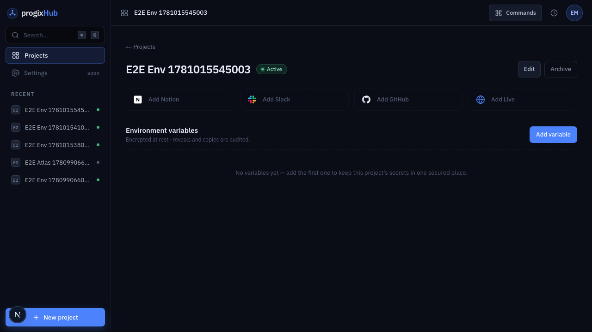
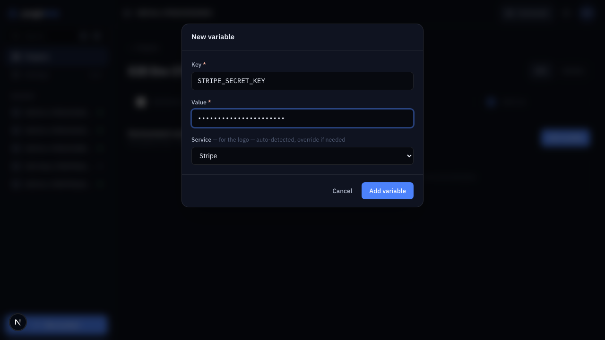
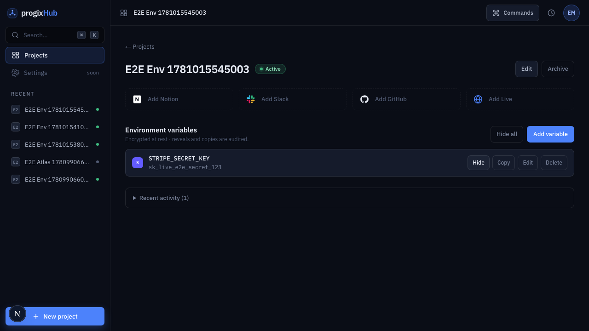
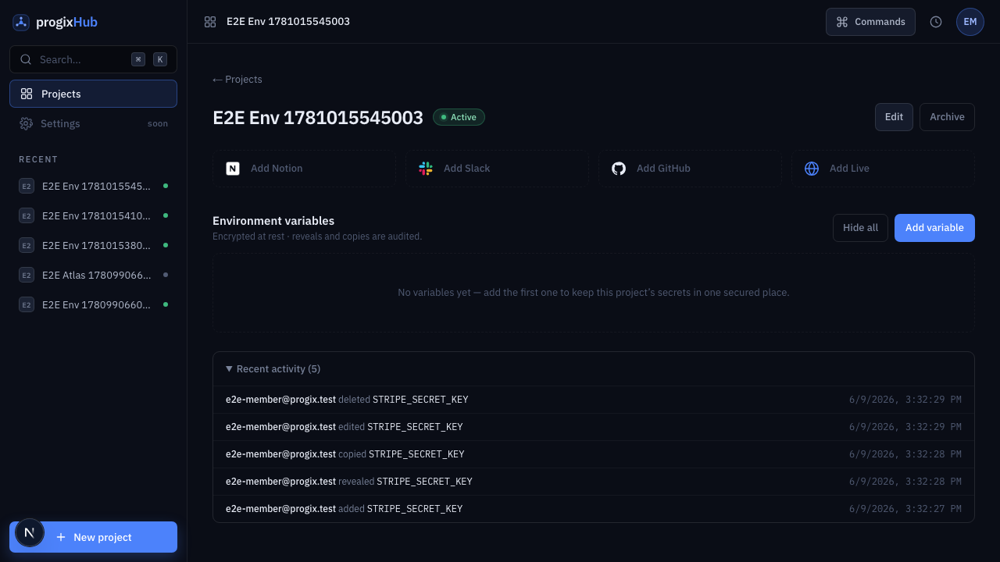
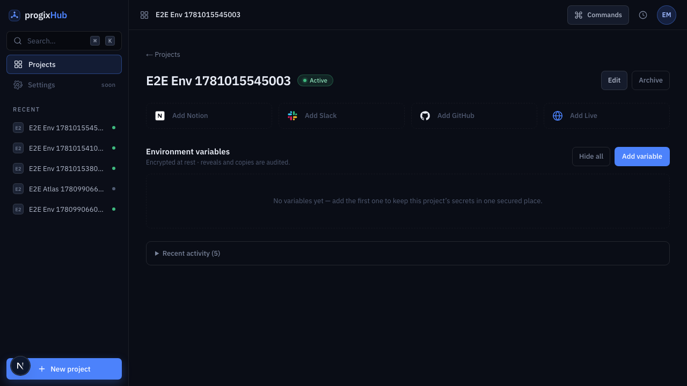

# Feature report — Secure environment variables per project

- **Spec:** [specs/003-secure-env-vars](../../specs/003-secure-env-vars/spec.md) · **Plan:** [plan.md](../../specs/003-secure-env-vars/plan.md) · **ADR:** [0007 — env-var encryption](../architecture/decisions/0007-env-var-encryption.md)
- **Branch:** `feat/003-secure-env-vars` vs `main` · **Date:** 2026-06-09 · **Author:** Achref Arabi (+ Claude)
- **Diff:** 52 files, +1953 / −53 · 13 commits

## What & why

A project's secrets — API keys, tokens, connection strings — were scattered across local `.env` files and DMs; progixHub is already the registry every project hangs off, so the env vars belong there too, behind the same login. This feature lets a signed-in Progix member add per-project variables (key + value + an auto-detected service logo), reveal/copy them on demand, and edit/delete them — with every value **encrypted at rest** and every create/edit/delete/reveal/copy written to an **append-only, non-repudiable audit trail**. It is MVP signature scope #2.

## Acceptance criteria → evidence

| AC                               | Proven by                                                                                                                                                                                 | Evidence                      | Verdict |
| -------------------------------- | ----------------------------------------------------------------------------------------------------------------------------------------------------------------------------------------- | ----------------------------- | ------- |
| AC-1 add + auto-logo             | `lib.test.ts` (`detectService`) · `env-vars-section.test.tsx` (row renders the matched logo) · e2e add step                                                                               | `env-create-form`, `env-list` | ✅ pass |
| AC-2 override logo               | `lib.test.ts` (override / neutral default) · `env-vars-section.test.tsx` (default for unknown service)                                                                                    | `env-list`                    | ✅ pass |
| AC-3 reveal audited              | `actions.test.ts` (decrypts the reveal RPC's ciphertext) · e2e (`revealed` shown in the trail)                                                                                            | `env-revealed`, `env-audit`   | ✅ pass |
| AC-4 copy audited                | e2e (clipboard holds the value via `grantPermissions`; `copied` shown in the trail)                                                                                                       | `env-audit`                   | ✅ pass |
| AC-5 encrypted at rest           | `aes-gcm.test.ts` (ciphertext ≠ plaintext, AAD cross-row-swap throws, tamper/wrong-key throw) · `actions.test.ts` (encrypt before RPC) · **live-DB:** ciphertext + member-`SELECT` denied | `0002_env_vars.sql`           | ✅ pass |
| AC-6 membership gate (non-happy) | `actions.test.ts` (all four actions NOT_AUTHORIZED without a member) · e2e `auth.spec.ts` (redirect) · **live-DB:** non-member RPC raise + audit-forgery denied                           | —                             | ✅ pass |
| AC-7 duplicate key (non-happy)   | `actions.test.ts` (`23505` → friendly field error) · e2e (duplicate add shows the message)                                                                                                | `env-list`                    | ✅ pass |
| AC-8 edit & delete               | `types.test.ts` (edit schema: blank value keeps the secret) · e2e (edit keeps value, delete removes the row)                                                                              | `env-deleted`                 | ✅ pass |
| AC-9 empty state                 | `env-vars-section.test.tsx` · e2e (invite state, not an error)                                                                                                                            | `env-empty`                   | ✅ pass |
| AC-10 full audit trail, retained | e2e (after delete: `revealed`/`copied`/`deleted` all shown, key still recorded) · **live-DB:** append-only (member `UPDATE/DELETE/TRUNCATE` revoked)                                      | `env-audit`                   | ✅ pass |

**Live-DB** = verified against the live database (Supabase MCP) + encoded in the migration's RLS/grants; a committed CI-runnable DB-integration test is deferred (see Follow-ups).

## Screenshots

|                                                                            |                                                        |
| -------------------------------------------------------------------------- | ------------------------------------------------------ |
| **Empty state** (AC-9) — invites the first variable                        |         |
| **Add form** (AC-1) — service auto-detected from the key, value masked     |  |
| **List** (AC-1/2/7) — Stripe logo auto-matched, value masked, row controls |           |
| **Revealed** (AC-3) — `Reveal`→`Hide`, value shown, "Hide all" appears     |   |
| **Audit trail** (AC-3/4/10) — create/reveal/copy/edit/delete, actor + key  |         |
| **After delete** (AC-8/10) — row gone, audit trail retained                |     |

## Changes by layer

- **Database** (`supabase/migrations/0002_env_vars.sql`, +209) — three tables (`env_vars` metadata · `env_var_secrets` isolated ciphertext · `env_var_audit` append-only) and four `SECURITY DEFINER` RPCs (`create/update/delete/reveal_env_var`). Ciphertext lives in a table with **no member policies and all grants revoked**; the audit table is **member-`SELECT`-only with INSERT/UPDATE/DELETE/TRUNCATE revoked**. Each RPC re-checks `app_metadata.is_member`, binds the actor from `auth.uid()`/JWT, and writes the audit row in the **same transaction** (reveal audits _before_ returning ciphertext).
- **Crypto** (`src/lib/crypto/{aes-gcm,keyring,secrets}.ts`) — AES-256-GCM, per-value IV, the row's id bound as **AAD** (defeats cross-row swap), a **versioned keyring** (rotation-ready), strict blob parsing, 32-byte key validation, fail-closed. Pure modules are env-free so they unit-test without `server-only`.
- **Slice** (`src/features/env-vars/`) — UI-only store (modal + revealed map + "Hide all"), RPC-backed server actions (`requireMember` → zod → `.rpc()` → encrypt/decrypt), server-only metadata reads, and the components (rows, reveal/copy, auto-detect form, audit disclosure, monogram logos).
- **App** (`src/app/projects/[id]/page.tsx`, `api/health/route.ts`) — the env section composed onto the project route; a public health canary that 503s on a missing keyring.
- **Core/CI** — `core/env.ts` keyring vars; the e2e + persona-review workflows guard on their secrets and skip cleanly when absent.

## Verification

- **`pnpm verify` green:** lint · typecheck · format · docs · typography · **53 unit tests (14 files)** · build.
- **e2e: 7/7 green** (CUJ-01/02/03 + signed-out), CUJ-03 captured the six screenshots above.
- **Pre-implementation design review** (adversarial, 5 lenses): 4 P0 + 4 P1 folded into ADR-0007 + the migration before any code.
- **Review board** (post-implementation): arch ✓ · appsec ✓ · qa ✗→✓ · ux ✓ · product ✓. AppSec/Arch found no P0/P1 — the design-review fixes were confirmed correctly implemented. QA's merge-blocker (docs crediting non-existent tests) was resolved by adding `actions.test.ts`, the logo-render test, and the e2e duplicate/retention assertions, and by correcting the AC→test table.

## Follow-ups (consciously deferred)

- **Committed DB-integration tests** for the DB-level invariants (ciphertext isolation, non-member RPC raise, audit-forgery, append-only) — verified live + encoded in grants, but need a member JWT against a **disposable CI Supabase project** (same gate as CI e2e). Top follow-up.
- **Real service logos** via `simple-icons` (currently brand-coloured monograms; Stripe/Supabase share "S") — its own ADR.
- **Bulk `.env` paste** and **per-environment scoping** (dev/staging/prod) — explicitly out of scope this spec.
- **aria-live "Copied" announcement** and raw-error-text mapping — minor, match existing patterns.

> PDF for sharing: `pnpm report:pdf 003-secure-env-vars`
