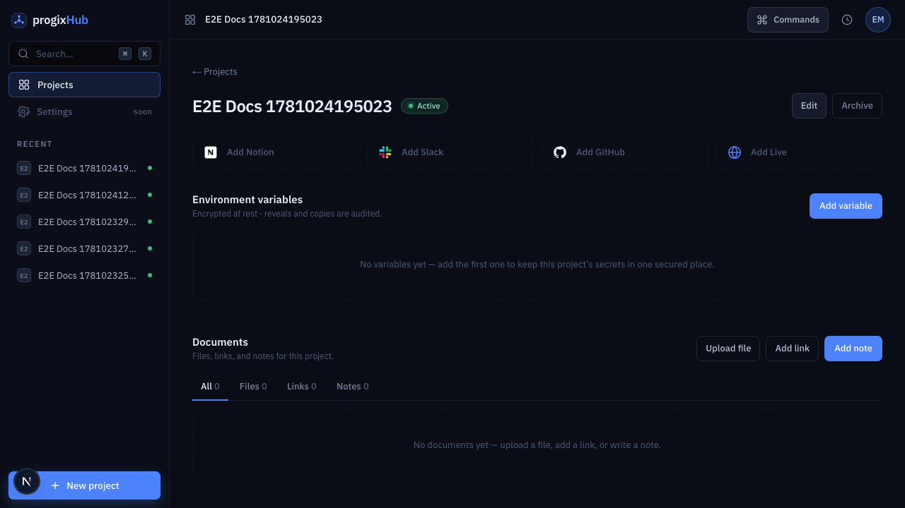
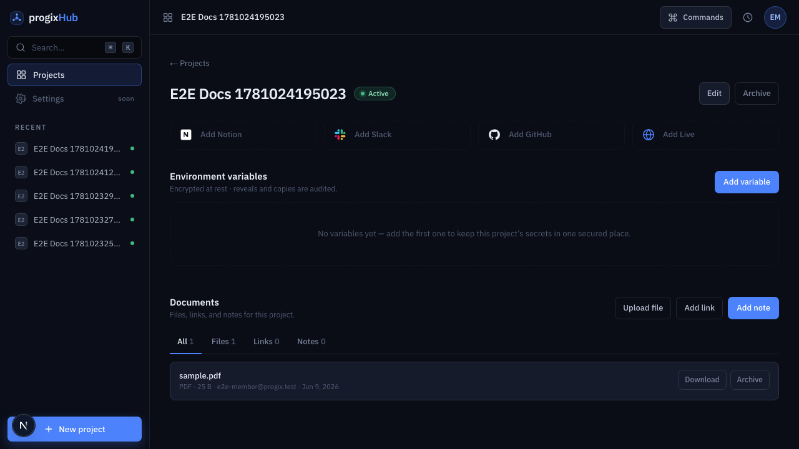
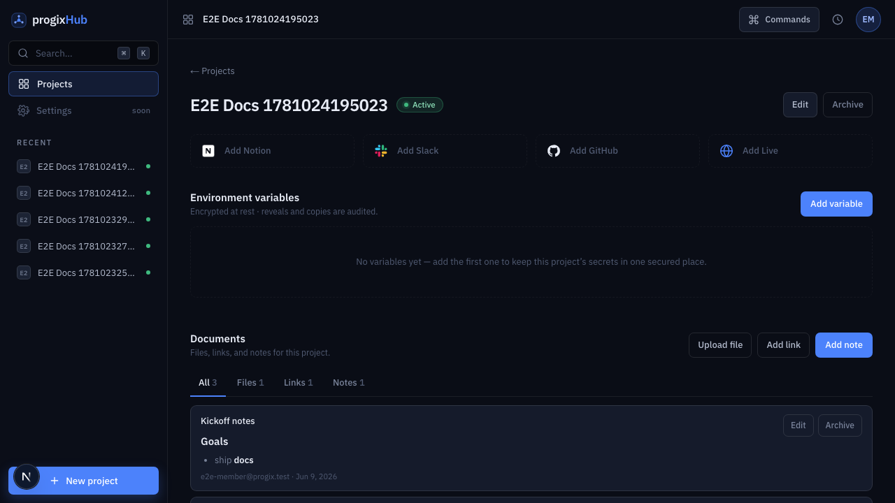
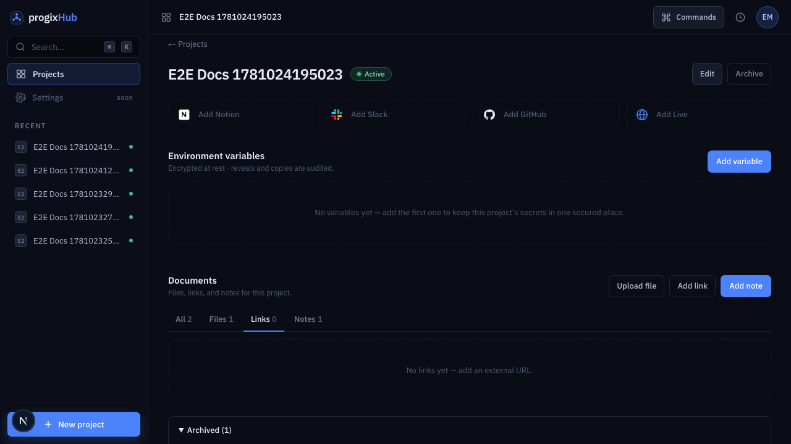

# Feature report — Documents per project

- **Spec:** [specs/004-documents](../../specs/004-documents/spec.md) · **Plan:** [plan.md](../../specs/004-documents/plan.md) · **ADR:** [0008 — rich-text notes](../architecture/decisions/0008-rich-text-notes.md)
- **Branch:** `feat/004-documents` vs `main` · **Date:** 2026-06-10 · **Author:** Achref Arabi (+ Claude)
- **Diff:** 33 files, +2573 / −7 · 6 commits

## What & why

A project's reference material — design files, spec PDFs, the Figma link, kickoff notes — was scattered across DMs and personal drives; progixHub is already the home every project hangs off, so its documents belong there too, behind the same login. This feature gives each project a tabbed **Documents** area — **All / Files / Links / Notes** — where a signed-in member can upload files (PDF, DOCX, images, ZIP, ≤ 50 MB) to a private store, save external links, and write rich-text notes, each row showing its type/size, **who added it**, and when. Removal is a reversible **archive** (no hard delete), and nothing is reachable outside the org. It is MVP signature scope #3.

## Acceptance criteria → evidence

| AC                               | Proven by                                                                                                                                                       | Evidence             | Verdict |
| -------------------------------- | --------------------------------------------------------------------------------------------------------------------------------------------------------------- | -------------------- | ------- |
| AC-1 upload a file               | `lib.test.ts` (`validateFile`) · `actions.test.ts` (`recordFile` re-validates + stamps uploader) · `documents-section.test.tsx` (uploader renders) · e2e upload | `doc-files`          | ✅ pass |
| AC-2 add a link                  | `actions.test.ts` (inserts link + stamps uploader) · `documents-section.test.tsx` (link row + tabs) · e2e add link                                              | `doc-all`            | ✅ pass |
| AC-3 add a note (rich text)      | `note-body.test.tsx` (renders Markdown; `<script>`/`` stripped) · e2e add note renders headings/bold                                                       | `doc-all`            | ✅ pass |
| AC-4 tabs filter                 | `lib.test.ts` (`byTab`) · `store.test.ts` (`setTab`) · `documents-section.test.tsx` (tabpanel wiring) · e2e switch to Links hides the file                      | `doc-all`            | ✅ pass |
| AC-5 reject bad file (non-happy) | `lib.test.ts` (oversize/type) · `types.test.ts` (`fileMetaSchema` rejects MIME + > 50 MB) · `actions.test.ts` (rejects without inserting)                       | —                    | ✅ pass |
| AC-6 membership gate (non-happy) | `actions.test.ts` (every action `NOT_AUTHORIZED` without a member) · **live-DB:** member reads, non-member denied, anon can't list the private bucket           | `0003_documents.sql` | ✅ pass |
| AC-7 archive & restore           | `actions.test.ts` (archive binds to `(id, project_id)`) · e2e archive hides the row → Archived panel → restore brings it back                                   | `doc-archived`       | ✅ pass |
| AC-8 edit a link/note            | `actions.test.ts` (update path) · e2e edits a link's title and it persists                                                                                      | `doc-all`            | ✅ pass |
| AC-9 empty state                 | `documents-section.test.tsx` (empty state, not an error) · e2e empty project                                                                                    | `doc-empty`          | ✅ pass |

**Live-DB** = verified against the live database (Supabase MCP) + encoded in the migration's RLS/grants, and exercised by `security.integration.test.ts` (`pnpm test:integration`, 8 tests green).

**Security hardening (review board, T16):** link URLs are pinned to `http(s)` (`types.test.ts` rejects `javascript:`/`data:`) closing a stored-XSS sink; download signed URLs force `Content-Disposition: attachment` so an uploaded SVG/HTML can't run script inline; notes are sanitized (`rehype-sanitize`, no `dangerouslySetInnerHTML`).

## Screenshots

|                                                                                  |                                                 |
| -------------------------------------------------------------------------------- | ----------------------------------------------- |
| **Empty state** (AC-9) — invites the first file, link, or note                   |        |
| **File row** (AC-1) — `PDF · 25 B · uploader · Jun 9, 2026`, with Download       |        |
| **All tab** (AC-2/3/4) — note renders Markdown; tab counts All 3 / Files 1 / …   |            |
| **Archived** (AC-7) — archived item kept in the Archived panel, with **Restore** |  |

## Changes by layer

- **Database** (`supabase/migrations/0003_documents.sql`, `0004_documents_uploader.sql`): a `documents` table (one row per item, `kind` ∈ file/link/note + kind-specific columns), deny-by-default RLS keyed on `app_metadata.is_member` (members SELECT/INSERT/UPDATE; **no DELETE** → archive-only); a **private** `project-documents` Storage bucket with a 50 MB + MIME whitelist and `storage.objects` policies gating access on membership. `0004` adds `created_by_email`, denormalized at write time (the RLS client can't read `auth.users` — mirrors 003's `actor_email`).
- **Feature slice** (`src/features/documents/`): server-only `data.ts` (list non-archived + archived), `"use server"` `actions.ts` (add-link / add-note / record-file / update / archive / restore / download-url — `requireMember` + zod + RLS client; file action re-validates size/MIME; mutations bind to `(id, project_id)`; download mints a 1-hour signed URL), a UI-only Zustand store (active tab + add/edit modal) behind a context provider, and components (`documents-section` tabs, `document-row`, `file-upload`, `doc-form`, `note-body`).
- **Notes rendering** (`note-body.tsx`): `react-markdown` + `rehype-sanitize` (ADR-0008) — XSS-safe rich text with no raw-HTML escape hatch.
- **App layer** (`src/app/projects/[id]/page.tsx`): the RSC fetches documents + archived in parallel and composes `<DocumentsSection>` after the env-vars section; `loading.tsx`/`error.tsx` present.
- **Accessibility:** the tabs implement the full WAI-ARIA pattern — `role="tablist"`/`tab`/`tabpanel`, `aria-controls`/`aria-labelledby`, and roving arrow/Home/End focus.

## Verification

- `pnpm verify` — **green** (lint, typecheck, format, docs link-check, typography, **83 unit tests**, production build).
- `pnpm test:integration` — **8 green** against the live Supabase project (member can read; non-member denied on `documents` + Storage; anon can't list the private bucket).
- `pnpm e2e` (CUJ-04, `e2e/documents.spec.ts`) — **green**: create project → upload a file → add a link → add a note → switch tabs → edit → archive → restore, capturing `doc-*` screenshots.
- **Review board (T16)** — 5 lenses (appsec, frontend, qa, ux, product). One **P0** confirmed and fixed (stored XSS via a `javascript:` link href); the second "P0" (no refresh after a mutation) was a **false positive** — every action calls `revalidatePath`, proven by the passing e2e. P1s fixed: uploader display (spec-required), `(id, project_id)` binding, dates via `formatDate`, copy/jargon, CUJ-04 registration, e2e de-flake. Net **+6 tests**.

## Follow-ups (consciously left open)

- **Shared destructive-confirm dialog + error-text token.** Archive uses `window.confirm` and error text uses the literal `#FFB6A2` — both are the established repo-wide patterns (env-vars uses the same), so this slice stays consistent. Promoting a styled confirm dialog and a `--red-text` token is a repo-wide cleanup, not a documents divergence. _(P2)_
- **Lazy-load the Markdown stack.** `react-markdown`/`rehype-sanitize` are statically imported into the always-rendered row island; `next/dynamic` would defer them until a note actually renders. Bundle hygiene only. _(P2)_
- **Verify the recorded file metadata against the stored object.** `recordFile` trusts client-supplied size/MIME (the bucket independently enforces the real limits, so it's display-only); a `storage.info(path)` reconciliation would harden it. _(P2)_
- **i18n.** UI ships English; the EN/FR toggle is spec 005.

---

_PDF: `pnpm report:pdf 004-documents` renders this for sharing outside the repo._
