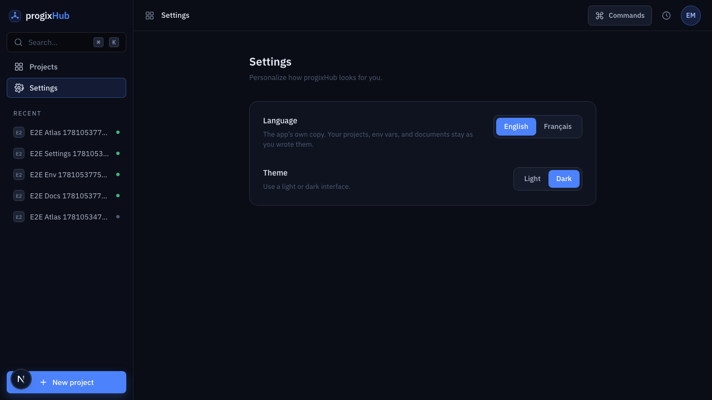
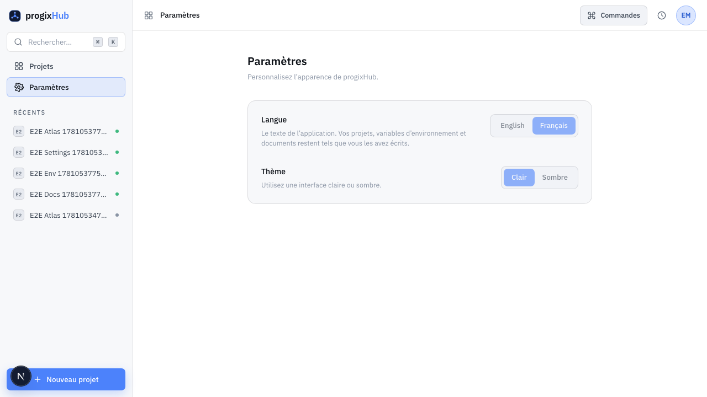
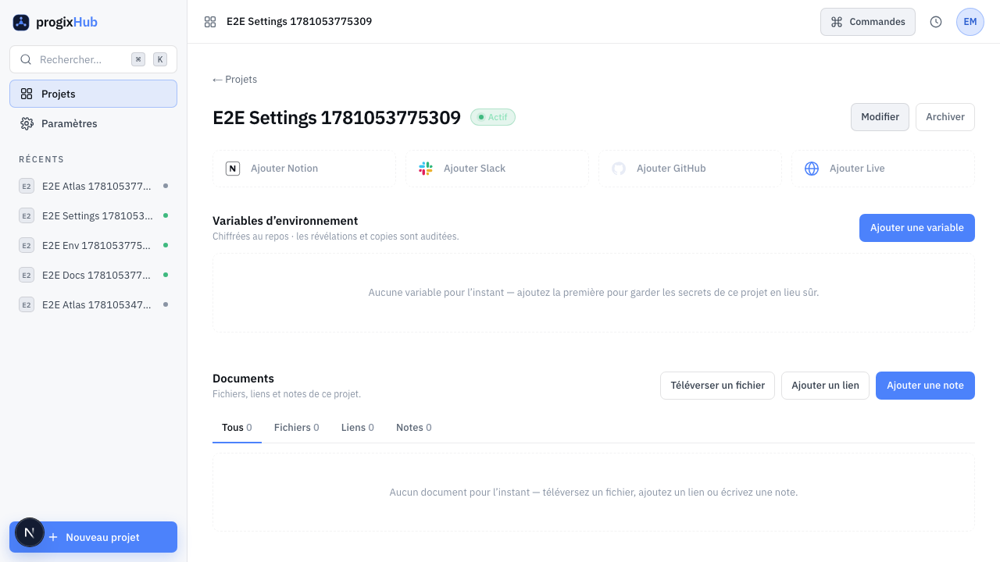

# Feature report — Settings (language & theme)

- **Spec:** [specs/005-settings](../../specs/005-settings/spec.md) · **Plan:** [plan.md](../../specs/005-settings/plan.md) · **ADR:** [0009 — i18n & theming](../architecture/decisions/0009-i18n-and-theming.md)
- **Branch:** `feat/005-settings` vs `main` · **Date:** 2026-06-10 · **Author:** Achref Arabi (+ Claude)
- **Diff:** 69 files, +2223 / −304 · 6 commits

## What & why

progixHub shipped 002–004 English-only and dark-only; the team works in English and French and not everyone wants a dark UI. This feature adds a **Settings** page with two controls — **language (English / Français)** and **theme (light / dark)** — and retrofits the whole app so its own copy is bilingual. Each member’s choice is **persisted per-user** (durable across sessions and devices) and applied on the **first server paint** with no flash; user-authored content (project names, env-var values, document contents) is never translated.

## Acceptance criteria → evidence

| AC                                   | Proven by                                                                                                                      | Evidence            | Verdict |
| ------------------------------------ | ------------------------------------------------------------------------------------------------------------------------------ | ------------------- | ------- |
| AC-1 see current settings            | `settings-controls.test.tsx` (toggles reflect `current`) · e2e opens `/settings`, both radiogroups visible                     | `settings-default`  | ✅ pass |
| AC-2 switch language                 | e2e: set Français → FR chrome renders **and a project name stays as typed** · the ~170-string migration                        | `settings-fr-light` | ✅ pass |
| AC-3 switch theme (entire app)       | e2e: `html[data-theme="light"]` · light verified on Settings **and** the project detail (env-vars + documents) `globals.css`   | `project-light-fr`  | ✅ pass |
| AC-4 persist across sessions/devices | `actions.test.ts` (`updateUser` called with `{locale,theme}` + cookie mirror) · e2e full reload keeps both                     | `settings-fr-light` | ✅ pass |
| AC-5 no flash on load                | e2e asserts the **raw server HTML** carries `lang="fr"` + `data-theme="light"` pre-hydration · `prefs.test.ts`                 | —                   | ✅ pass |
| AC-6 missing translation → English   | `messages.test.ts` (deepMerge keeps English per key; every English key present in merged French; parity has no orphan FR keys) | —                   | ✅ pass |
| AC-7 auth gate (non-happy)           | `auth.spec.ts` (signed-out `/settings` → `/sign-in`) · `actions.test.ts` (non-member denied, no write)                         | —                   | ✅ pass |

## Screenshots

|                                                                                      |                                                     |
| ------------------------------------------------------------------------------------ | --------------------------------------------------- |
| **Settings — English / Dark** (AC-1) — the two controls, current prefs selected      |    |
| **Settings — Français / Clair** (AC-2/3) — full FR chrome, light palette, nav active |  |
| **Project detail — Français / Clair** (AC-3) — env-vars + documents legible in light |       |

## Changes by layer

- **i18n foundation** (`src/i18n/{request,messages}.ts`, `src/messages/{en,fr}.json`, `next.config.ts`): `next-intl` **without locale routing** ([ADR-0009](../architecture/decisions/0009-i18n-and-theming.md)). The request locale is resolved per-request from the per-user preference; English is underlaid under French so any untranslated key falls back to English (AC-6). One namespaced catalog pair (~170 keys).
- **Preferences** (`src/lib/settings/{prefs,server}.ts`): `resolvePrefs` with precedence **cookie → JWT `user_metadata` → default**; `getServerPrefs` reads them server-side with **no DB call** (the JWT carries `user_metadata`), `cache()`-deduped.
- **Theme** (`src/app/globals.css`): a `:root[data-theme="light"]` token set (dark stays the `:root` default); a new `--red-text` token replaces a hardcoded error-text hex across the app (legible in both themes).
- **Root layout** (`src/app/layout.tsx`): now `async` — reads prefs and sets `<html lang data-theme>` on the server so the first paint is correct (AC-5); wraps the tree in `NextIntlClientProvider`. A `global-error.tsx` covers throws originating in the async layout.
- **String migration**: ~170 hardcoded strings across the app shell, auth, projects, env-vars, and documents moved to `useTranslations`/`getTranslations`; zod-schema and server-action error messages became keys resolved at the boundary; the client file-validator returns reason codes; dates/numbers are locale-aware (`src/lib/format.ts`).
- **Settings slice** (`src/features/settings/`): `updateSettingsAction` (member-gated, zod-enum-validated; **cookie is the authoritative per-device store, set first and unconditionally; `user_metadata` is best-effort cross-device sync**), accessible segmented language/theme toggles (WAI-ARIA radiogroup with roving arrow-key focus), and the `/settings` route. The sidebar **Settings** nav item is activated and the nav is route-aware.

## Verification

- `pnpm verify` — **green** (lint, typecheck, format, docs, typography, **101 unit tests**, build).
- `pnpm e2e` — **green, 10/10** (CUJ-05 + AC-7; full suite confirms the settings spec’s `afterEach` reset leaves no locale pollution for the English-asserting specs).
- **Review board (T19)** — appsec **APPROVE** (locale/theme validated as an enum at write, re-validated by type guard at read; no arbitrary string reaches a cookie/`<html>`/dynamic import; authz precedes every write). frontend **APPROVE WITH NITS**. qa **APPROVE WITH NITS** (7/7 ACs, no test theater). UX/a11y **REQUEST CHANGES** → all four P1s fixed: route-aware active nav, radiogroup keyboard contract, light-mode unselected-label contrast (AA), and light-mode feature-screen coverage. Net **+7 settings tests**.

## Follow-ups (consciously left open)

- **Single shared `getClaims()` per request.** `getServerPrefs` and `getCurrentUser` each verify the JWT in their own `cache()` scope (local verification, no DB cost). A shared cached claims accessor would read the token once. _(P2)_
- **Make `formatDate`/`formatNumber` locale required** (drop the `"en"` default) so a future caller can’t silently render English-formatted dates in a French session. _(P2)_
- **E2E baseline seeding.** The settings spec resets the shared test user to en/dark in `afterEach`; seeding a deterministic baseline at `auth.setup` would make runs order-independent even if a reset fails. _(P2)_
- **Log the best-effort `updateUser` failure** (without PII) so a persistent cross-device-sync failure is observable. _(P2)_
- **System/auto theme + browser-language auto-detect** and **languages beyond EN/FR** are out of scope (spec 005).

---

_PDF: `pnpm report:pdf 005-settings` renders this for sharing outside the repo._
