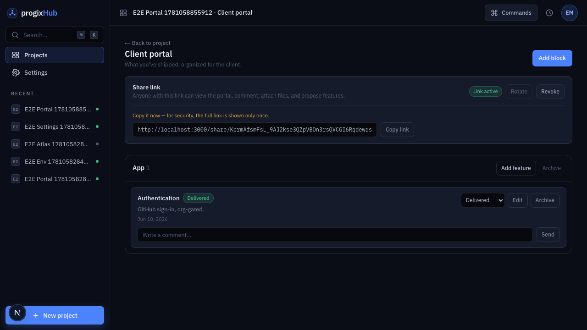
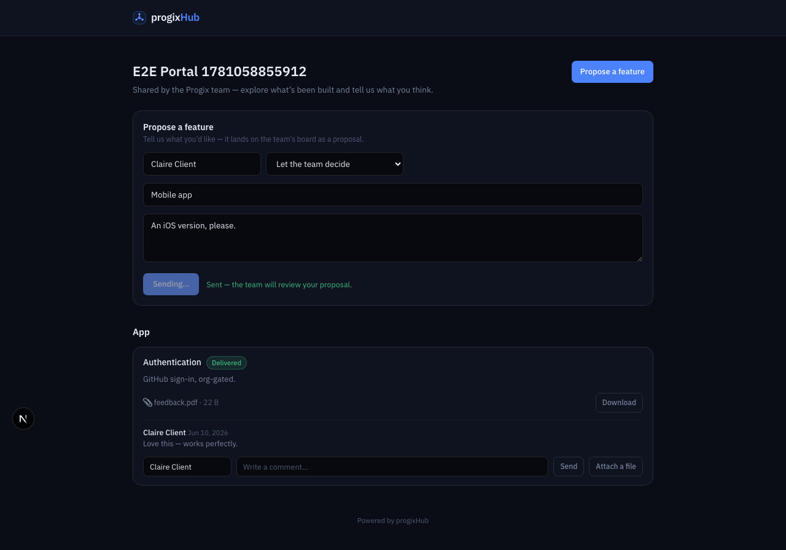
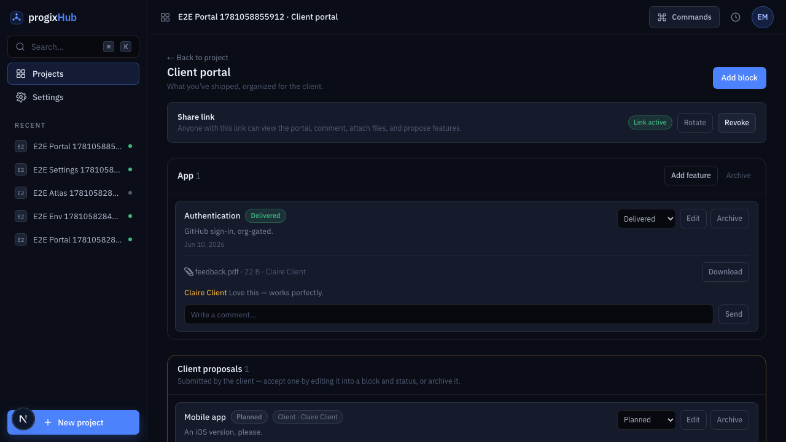
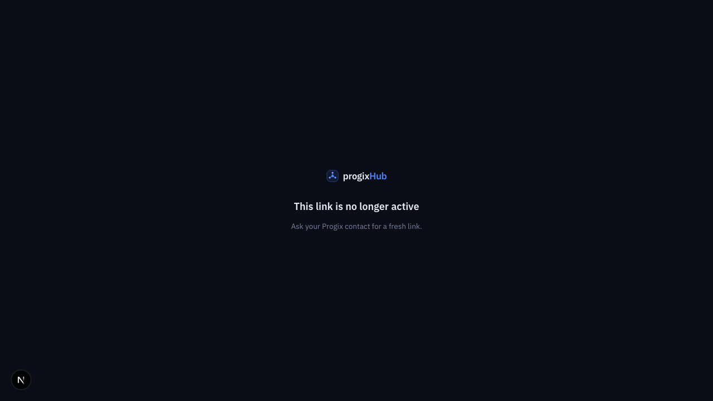

# Feature report — Client portal

- **Spec:** [specs/006-client-portal](../../specs/006-client-portal/spec.md) · **Plan:** [plan.md](../../specs/006-client-portal/plan.md) · **ADR:** [0010 — public trust tier](../architecture/decisions/0010-client-portal-trust-tier.md)
- **Branch:** `feat/006-client-portal` vs `main` · **Date:** 2026-06-10 · **Author:** Achref Arabi (+ Claude)
- **Diff:** 44 files, +3817 / −22 · 5 commits

## What & why

This delivers the PRD’s MVP #4 — evolved from a one-way “feedback page” into a two-way **client portal**. The team organizes delivered work into named **blocks** (App, Backend, Website…) holding **feature cards** (title, description, status: delivered / in progress / planned / proposed); the client opens a revocable, unguessable **share link** — no account — to read everything and respond in place: comment, attach files, and propose features that land as triageable cards. It is the app’s **first external surface**, so it introduces a new trust tier ([ADR-0010](../architecture/decisions/0010-client-portal-trust-tier.md)) with hardened, deny-by-default boundaries.

## Acceptance criteria → evidence

| AC                                | Proven by                                                                                                                          | Evidence               | Verdict |
| --------------------------------- | ---------------------------------------------------------------------------------------------------------------------------------- | ---------------------- | ------- |
| AC-1 blocks & cards               | `actions.test.ts` (create/status binds to `(id, project_id)`) · `portal-section.test.tsx` · e2e build steps                        | `portal-member-filled` | ✅ pass |
| AC-2 share-link lifecycle         | `actions.test.ts` (raw token returned once, only SHA-256 stored; rotate revokes-then-mints) · e2e rotate → inactive                | `portal-member-filled` | ✅ pass |
| AC-3 client views (no member nav) | `share-view.test.tsx` (no member nav) · **live-DB** RPC read scoped to one project · e2e fresh anonymous context                   | `portal-client`        | ✅ pass |
| AC-4 client comments              | `public-actions.test.ts` (validated input → RPC) · **live-DB** comment lands · e2e                                                 | `portal-client`        | ✅ pass |
| AC-5 client attaches a file       | `lib.test.ts` + `public-actions.test.ts` (type/size reject before upload; upload-after-token; cleanup on RPC reject) · e2e         | `portal-client`        | ✅ pass |
| AC-6 client proposes a feature    | `public-actions.test.ts` · **live-DB** (`origin=client`, `status=proposed`) · e2e propose → member triages to Planned              | `portal-member-triage` | ✅ pass |
| AC-7 security boundary            | **live-DB:** anon table SELECT denied; invalid/revoked token → null; forged path rejected; bucket not anon-listable                | `0005_portal.sql`      | ✅ pass |
| AC-8 abuse guards                 | `public-actions.test.ts` (honeypot drop, rate-limit→friendly copy) · `share-view.test.tsx` (text inert) · **live-DB** rate limit   | —                      | ✅ pass |
| AC-9 member gate vs public        | `actions.test.ts` (every member action refuses a non-member) · e2e `auth.spec.ts` (member portal → sign-in; `/share` stays public) | —                      | ✅ pass |

**Live-DB** = `src/features/portal/security.integration.test.ts` — 8 tests against the live Supabase project (`pnpm test:integration`).

## Screenshots

|                                                                                           |                                                           |
| ----------------------------------------------------------------------------------------- | --------------------------------------------------------- |
| **Member portal** (AC-1/2) — blocks + cards + statuses; the share link shown once         |  |
| **Client view** (AC-3/4/5/6) — read-only tree, comment/attach/propose, no member nav      |         |
| **Member triage** (AC-6) — a client proposal in the inbox, accepted via the status select |  |
| **Inactive link** (AC-2) — a rotated-away token gets a friendly screen, never an error    |     |

## Changes by layer

- **Database** (`supabase/migrations/0005_portal.sql`): 5 tables (share links with a **hashed token** + partial-unique active-per-project index; blocks; cards; comments; attachments), deny-by-default member RLS (no DELETE → archive). The anon role has **zero table grants** — its entire surface is **four `SECURITY DEFINER` RPCs** (`portal_public_view/comment/propose/record_attachment`), each resolving token→one project and enforcing a 10-writes/min rate limit, row caps, a path-prefix guard, and a MIME re-check; helper functions are revoked from every API role; all functions pin `search_path = ''`. Private `portal-attachments` bucket (10 MB + whitelist) with a member-only SELECT policy.
- **Admin client** (`src/lib/supabase/admin.ts`): the first sanctioned production use of the service-role key — `server-only`, fails closed, reached **only after** token validation for the upload/download path.
- **Slice** (`src/features/portal/`): server-only `data.ts` (member RLS read) + `public-data.ts` (one anon RPC); `actions.ts` (member CRUD + share-link mint/rotate/revoke — `randomBytes(32)`, only the SHA-256 persisted) + `public-actions.ts` (token-gated comment/propose/attach with honeypot, pre-upload rate gate, friendly error mapping); UI-only store; member + public components.
- **Routes**: `/projects/[id]/portal` (member, AppShell, entry link on the project page) and `/share/[token]` (standalone chrome, no member nav); `/share` added to the middleware public paths.
- **i18n**: a full `portal` namespace in EN + FR.

## Verification

- `pnpm verify` — **green** (lint, typecheck, format, docs, typography, **132 unit tests**, build).
- `pnpm test:integration` — **16 green** (8 new portal security invariants against the live DB).
- `pnpm e2e` — **green, 12/12**: CUJ-06 drives a member session **and a fresh anonymous browser context** (a real client with no account) through view → comment → attach a PDF → propose → member triage → rotate → inactive.
- **Review board (T17)** — appsec / qa / ux **APPROVE WITH NITS**, frontend **APPROVE**. **No P0s.** Fixed: pre-upload rate gate (Storage-spam bypass), generic member errors (no schema leak), input aria-labels, comment-error placement, modal close button, oversize-attachment test, CUJ-06 registration, e2e cleanup.

## Follow-ups (consciously left open)

- **Promote the hand-rolled dialog + input/button primitives** to `@/components/ui` (shadcn `Dialog` for focus-trap) before the pattern spreads. _(P2)_
- **Dedupe the token→project resolver** across the two public attachment actions into a server-only helper. _(P2)_
- **`image/svg+xml`** stays whitelisted (safe today because downloads force attachment disposition — invariant now documented in code). Revisit if that flag ever changes. _(P2)_
- **`getMemberAttachmentUrlAction` scopes by `id` only** — correct under flat membership; revisit if per-project member scoping is introduced. _(P2)_
- **Paperclip icon instead of the 📎 emoji**, non-breaking space in size units catalog-wide, and per-link expiry / client-facing language toggle / email notifications — all deferred.

---

_PDF: `pnpm report:pdf 006-client-portal` renders this for sharing outside the repo._
