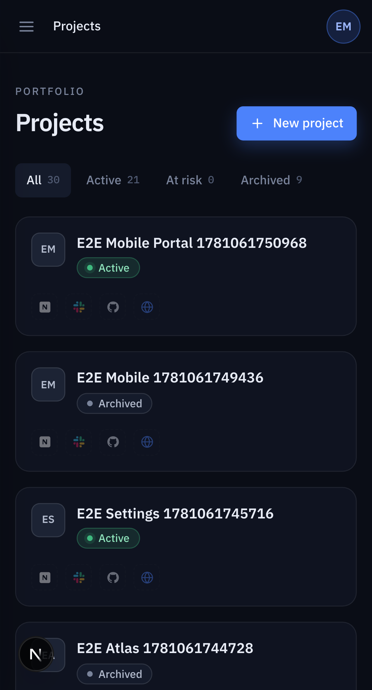
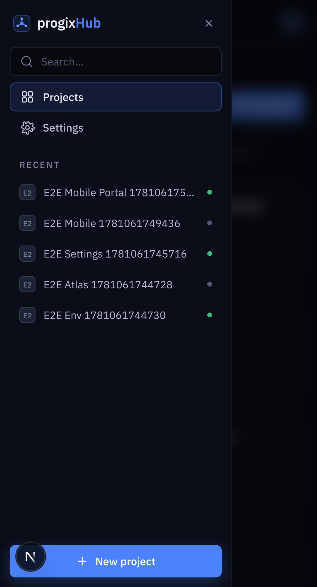
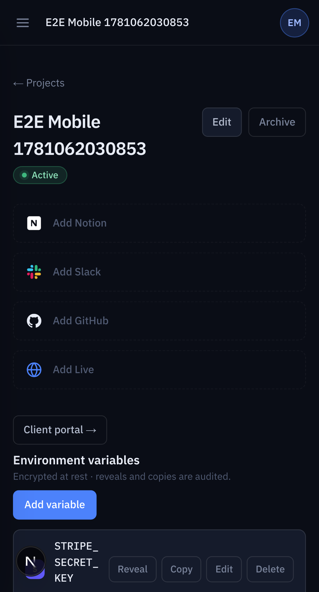
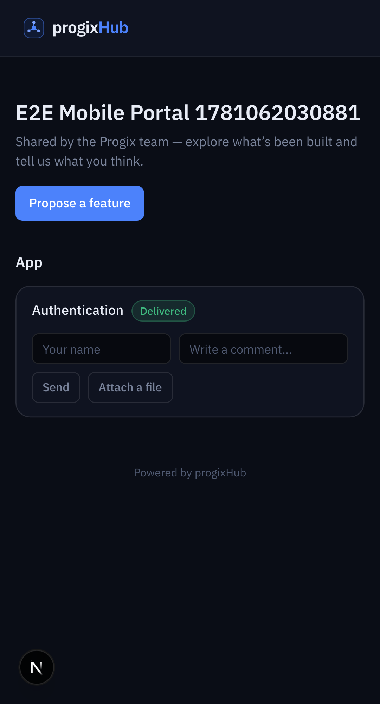

# Feature report — Mobile responsiveness + installable PWA

- **Spec:** [specs/007-mobile-responsive-pwa](../../specs/007-mobile-responsive-pwa/spec.md) · **Plan:** [plan.md](../../specs/007-mobile-responsive-pwa/plan.md)
- **Branch:** `feat/007-mobile-responsive-pwa` vs `main` · **Date:** 2026-06-10 · **Author:** Achref Arabi (+ Claude)
- **Diff:** 36 files, +637 / −80 · 4 commits

## What & why

progixHub was built desktop-first — a fixed 240px sidebar, multi-column rows, wide modals — so on a phone the sidebar ate the screen, rows overflowed, and the app couldn’t be “installed.” This pass makes every screen usable from ~320px up with no horizontal scrolling, collapses the sidebar into a mobile nav drawer, makes the **public client portal mobile-first** (clients open share links on their phones), and adds a web-app manifest so the app installs as a home-screen shortcut. **Presentation + a manifest only — no data, action, or RLS change** (roles are spec 008).

## Acceptance criteria → evidence

| AC                          | Proven by                                                                                                                                                                                 | Evidence                | Verdict |
| --------------------------- | ----------------------------------------------------------------------------------------------------------------------------------------------------------------------------------------- | ----------------------- | ------- |
| AC-1 no overflow            | `mobile.spec.ts` `expectNoHorizontalOverflow` on portfolio, project detail (populated), share page (Pixel 5, 393px)                                                                       | `project-detail-mobile` | ✅ pass |
| AC-2 mobile nav drawer      | `mobile.spec.ts`: hamburger visible at phone width → drawer opens (nav shown) → close hides it                                                                                            | `drawer-mobile`         | ✅ pass |
| AC-3 rows reflow            | `mobile.spec.ts`: a real env-var row is added; the populated list has no horizontal scroll + the Reveal control is reachable                                                              | `project-detail-mobile` | ✅ pass |
| AC-4 forms & dialogs fit    | `mobile.spec.ts`: the new-project dialog’s bounding box is within the viewport + submit reachable                                                                                         | —                       | ✅ pass |
| AC-5 client portal on phone | `mobile.spec.ts`: opens `/share/<token>` at 393px, reads cards, **submits a comment**, no overflow                                                                                        | `share-mobile`          | ✅ pass |
| AC-6 installable            | `mobile.spec.ts`: `/manifest.webmanifest` valid (name/display/start_url/theme_color/icons); `/icon.svg` + `/apple-icon` resolve; SSR head wires manifest + apple-touch-icon + theme-color | `public/icon.svg`       | ✅ pass |
| AC-7 desktop unchanged      | the full desktop CUJ suite (CUJ-01..06) stays green — every responsive class is additive at `< md`                                                                                        | —                       | ✅ pass |

## Screenshots

|                                                                          |                                                                    |
| ------------------------------------------------------------------------ | ------------------------------------------------------------------ |
| **Portfolio** — phone width, hamburger nav, cards stacked                |    |
| **Nav drawer** — sidebar as a slide-in modal over a backdrop             |          |
| **Project detail** — title wraps, Edit/Archive wrap, surface links stack |  |
| **Client share page** — mobile-first; comment/attach/propose reachable   |            |

## Changes by layer

- **App shell** (`src/components/app-shell/`): `AppShell` (server) now delegates to a client `AppFrame` that owns the `navOpen` drawer state. `Sidebar` renders a static `hidden md:flex` desktop aside (unchanged) plus a `md:hidden` slide-in **modal drawer** — `role="dialog"` + `aria-modal`, focus moves in on open, Tab is trapped, focus returns to the opener on close, body scroll is locked, and the drawer content is mounted only while open (so nav/recent links aren’t duplicated in the DOM). `TopBar` gains a `md:hidden` hamburger (40px) and collapses the Commands label below `sm`.
- **Responsive polish** (class-only, every feature slice): section padding `px-6 → px-4 sm:px-6`; headers, rows, and button groups `flex-wrap`; `min-w-0` + `break-all`/`truncate` on long keys/URLs/file names; the documents tablist scrolls within itself; the project-detail H1 wraps instead of truncating.
- **PWA** (`src/app/manifest.ts`, `src/app/apple-icon.tsx`, `public/icon.svg`, `layout.tsx`): a `MetadataRoute.Manifest` (standalone, theme-color, brand icons), a maskable SVG icon from the brand `LogoMark`, an iOS apple-touch icon generated via `next/og`, and a mobile-first `viewport` + `themeColor`.
- **i18n**: `nav.openMenu` / `nav.closeMenu` / `nav.menu` in EN + FR.
- **Verification**: a `mobile` Playwright project (Pixel 5) + `e2e/mobile.spec.ts`.

## Verification

- `pnpm verify` — **green** (lint, typecheck, format, docs, typography, **132 unit tests**, build).
- `pnpm e2e` — **green, 15/15**: the desktop CUJ-01..06 suite (AC-7 regression guard) plus 3 mobile tests at 393px.
- **Review board (T16)** — frontend **APPROVE WITH NITS**, qa **APPROVE WITH NITS**, ux **REQUEST CHANGES**. Fixed: the drawer’s **modal a11y** (focus trap / `aria-modal` / scroll-lock / return-focus), the detail-page **H1 truncation**, **tap-target** sizes, mobile e2e **cleanup** + stronger functional assertions (populated row, dialog-bounds, real comment submit).

## Follow-ups (consciously left open)

- **Promote the drawer to a shared shadcn/Radix `Sheet`** so future modals inherit focus-trapping/ARIA rather than copying the hand-rolled one. _(P2)_
- **Offline / service worker / push notifications** and **native packaging** — explicitly out of scope (manifest-only install).
- The new roles UI (spec 008) is built on this now-responsive shell.

---

_PDF: `pnpm report:pdf 007-mobile-responsive-pwa` renders this for sharing outside the repo._
