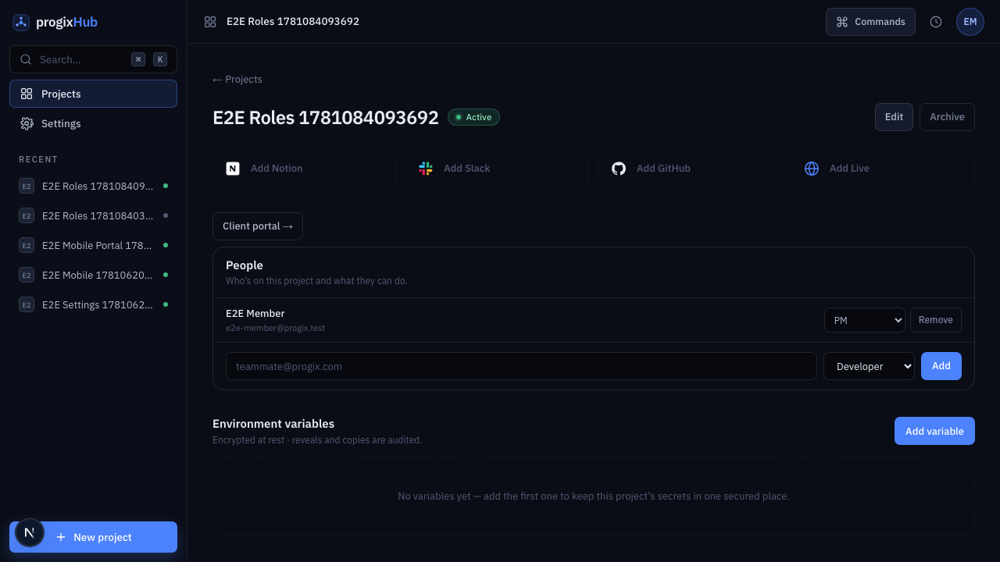
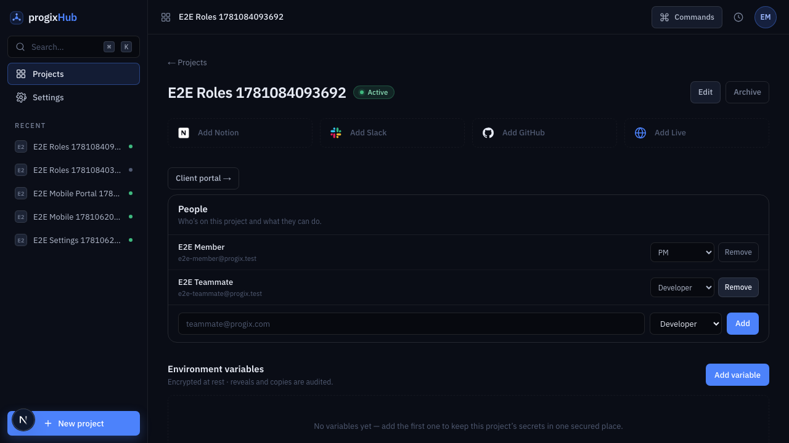

# Feature report — 008 Roles & permissions

- **Spec:** [specs/008-roles-permissions/spec.md](../../specs/008-roles-permissions/spec.md) · [plan](../../specs/008-roles-permissions/plan.md) · [tasks](../../specs/008-roles-permissions/tasks.md)
- **ADR:** [0011 — Roles & permissions](../architecture/decisions/0011-roles-and-permissions.md)
- **Branch:** `feat/008-roles-permissions` · **PR:** _(opened with this report)_
- **Date:** 2026-06-10 · **Author:** Achref Arabi (+ Claude Opus 4.8)

## What & why

Permissions were flat: any signed-in org member could do anything to any project — reveal every secret, edit every document, see projects they weren't on. This spec replaces that with two enforced tiers: an **org superadmin** (the owners — Achref, and Ilyes when seeded) who bypasses per-project checks, and **per-project roles** (PM, developer, video editor, viewer) where a member has _no access to a project until added to it_. Authorization lives in the database (RLS + `SECURITY DEFINER` RPCs), so forbidden actions are rejected even when attempted directly against the API — the UI gating is only a courtesy on top.

## Acceptance criteria → evidence

| AC       | What it requires                                                                      | Proof                                                                                                                                                                                                   | Verdict |
| -------- | ------------------------------------------------------------------------------------- | ------------------------------------------------------------------------------------------------------------------------------------------------------------------------------------------------------- | ------- |
| **AC-1** | Superadmin sees + acts on every project, no membership needed                         | `roles.integration.test.ts` "AC-1: superadmin sees + manages a project with no membership row" (reads project + env vars, sets a member)                                                                | ✅ Pass |
| **AC-2** | A non-member sees nothing of a project (not listed, detail not returned)              | `roles.integration.test.ts` "AC-2: a non-member sees nothing" (projects/documents/portal all empty) **+** new "AC-2: a removed creator can no longer read their old project" (the carve-out fix)        | ✅ Pass |
| **AC-3** | PM/superadmin manages People; a non-PM is rejected                                    | integration "AC-3: a developer (non-PM) cannot manage People" (RPC raises `not authorized`) **+** e2e CUJ-07 (PM adds/changes/removes) **+** `actions.test.ts` authz                                    | ✅ Pass |
| **AC-4** | Developer can reveal secrets; video editor can't even see env vars but can write docs | integration "AC-4: developer can reveal secrets; video editor cannot even see env vars" (dev reveals ciphertext; video sees 0 env rows, reveal rejected, doc insert succeeds)                           | ✅ Pass |
| **AC-5** | Viewer reads; every mutation rejected                                                 | integration "AC-5: a viewer reads but every mutation is rejected" (reveal, doc insert, portal comment, set-member all rejected) **+** UI gating tests hide write controls                               | ✅ Pass |
| **AC-6** | Creator becomes PM; backfill seats existing creators + Achref superadmin              | integration "AC-6: a freshly created project auto-gets a PM row (trigger)" **+** live-data check: **58/58** creator-owned projects have their creator as PM, **0** PM-less projects, owner = superadmin | ✅ Pass |
| **AC-7** | The last PM can't be demoted or removed                                               | integration "AC-7: the last PM cannot be demoted or removed" (both raise `last_pm`) **+** `actions.test.ts` friendly-copy mapping                                                                       | ✅ Pass |
| **AC-8** | Enforced at the data layer, not just the UI                                           | The entire `roles.integration.test.ts` suite drives RLS + RPCs directly as each role (no UI) — 8 assertions across the matrix                                                                           | ✅ Pass |

The matrix is proven by a **live-DB integration suite** that provisions a superadmin + one real signed-in user per role + an outsider on a real project, then asserts each cell. That suite is AC-8.

## Screenshots

_The People panel (PM/superadmin only): the project's roster with a per-member role select and Remove, plus an add-by-email form. The creator is listed as PM._

_After adding a teammate by email as Developer: the new member appears with their role select. Changing the select re-keys their access; the env-vars section renders below (the PM can see it)._

Per-role _hiding_ (a video editor has no env-vars section; a viewer sees read-only sections with a "read-only access" notice) is enforced server-side and proven by the integration suite; the screenshots above are the PM/superadmin view captured by CUJ-07.

## Changes by layer

**Data layer (the enforcement heart) — `supabase/migrations/`**

- `0006_roles.sql` (+314): `project_members(project_id, user_id, role)` table; three `SECURITY DEFINER` helpers (`is_superadmin()` reads the JWT, `has_project_access(project, roles[])`, `my_project_role(project)`); an `AFTER INSERT` trigger seating a creator as PM; a **full RLS rewrite** across projects / env*vars / env_var_audit / documents / portal*\* / storage to the ADR-0011 capability matrix (env_vars SELECT excludes video_editor; documents/portal writes = pm·dev·video; project UPDATE = pm); env-var RPCs re-keyed to `has_project_access(·, ['pm','developer'])`; People RPCs `set_project_member` / `remove_project_member` (PM/superadmin gate, email→user resolution, **last-PM guard**); backfill of existing creators → PM and Achref → superadmin.
- `0007_people_list.sql` (+21): `list_project_members(project)` — the roster read for the People panel.
- `0008_create_project_rpc.sql` (+60): **the review fix.** A `create_project` `SECURITY DEFINER` RPC creates the project and lets the trigger seat the PM membership atomically, returning the row — so the read-back no longer needs the leaky `created_by = auth.uid()` carve-out, which is dropped from the projects SELECT policy.

**Server auth — `src/lib/auth/`**: `session.ts` adds `isSuperadmin` to the claims read + `getProjectRole(projectId)` (RPC `my_project_role`); `roles.ts` is a pure, client-safe `capabilities(role)` matrix (no `server-only`, so client islands can gate on it).

**People slice — `src/features/people/`** (new): `types.ts` (role enum + zod), `data.ts` (roster read), `actions.ts` (`setProjectMemberAction` / `changeMemberRoleAction` / `removeProjectMemberAction`), `components/people-panel.tsx`.

**UI gating**: the project page computes the caller's role and threads `canWrite` / `canManage` flags into the env-vars / documents / portal / project-detail sections (hiding what a role can't do) and renders the People panel only for PM/superadmin. A **read-only notice** now appears for roles with no write capability.

**Notable decisions**

- _Project creation moved behind an RPC._ The original carve-out let a creator read back a freshly-inserted project before the AFTER-trigger seated their membership — but `created_by` is immutable, so it permanently leaked project metadata to a _removed_ creator (an AC-2 violation the review caught). The `create_project` RPC closes this by making creation + membership atomic; the four integration suites and the create-project UI path were migrated to it.
- _`capabilities()` is pure._ Splitting the matrix out of the `server-only` session module lets the same function gate both the RSC page and client leaves without bundling server code.

## Verification

- **`pnpm verify`:** green — lint, typecheck, format, docs, typography, **149 unit tests** (34 files), production build.
- **`pnpm test:integration`:** green — **24 tests** (4 suites) against the live DB, including the 8-assertion roles matrix.
- **`pnpm e2e`:** green — **17 tests** including CUJ-07 (People) and the backward-compat CUJ-02..06 for a PM/superadmin.
- **Supabase advisors:** clean relative to baseline — `create_project` is in the same intended "authenticated DEFINER RPC" class as the existing RPCs (each does its own authz check); no new findings.
- **Review board (T15)** — appsec / frontend / qa / ux:
  - **AppSec:** no P0. **P1 fixed** — the projects-read carve-out leak (above). Confirmed every helper is `SECURITY DEFINER … set search_path=''`, role-sets match the matrix, no privilege-escalation path, storage path parsing safe, `anon` revoked everywhere.
  - **QA:** approve-with-nits. **P1s fixed** — `changeMemberRoleAction` now has unit coverage; AC-6 backfill verified on live data.
  - **Frontend:** approve-with-nits, no P0/P1.
  - **UX/i18n:** approve-with-nits. **P1 fixed** — read-only affordance added; a11y nits (aria fallbacks, field-error `role="alert"`) fixed; French catalog verified natural with correct typography.

## Follow-ups (consciously left open)

- **`window.confirm` → styled dialog.** Destructive confirms use the native `window.confirm` across the whole app (portal, documents, env-vars, and now People — 6 call sites). Replacing only People would make it inconsistent; building a confirm-dialog primitive and migrating all six is its own small refactor. Tracked, not done here.
- **Role badges** alongside the editable select for at-a-glance roster scanning (UX P2).
- **`changeMemberRoleAction` double round-trip** — it resolves email via `list_project_members` then calls `set_project_member`; a `set_project_member_by_id` RPC would make it one call (frontend P2).
- **Capability flags default to `true`** on the section components (fail-open in the UI, though RLS backstops every write). Making them required would force every render site to state the capability (frontend P2).
- **Spec out-of-scope (unchanged):** email invitations to account-less people, an in-app "make superadmin" control, and a People-change audit log remain later enhancements.
